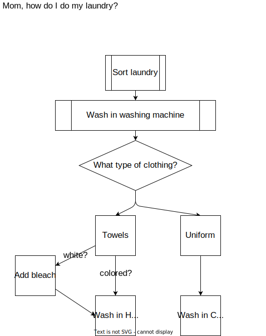

# Unit 5 - Flow Control

There are several devices that Python offers to allow programmers to control the flow of a program based on user input or the state of variables.  We will be covering the following devices:

| Device | Description |
|------------|-------------|
| `if-elif-else` | Execute a certain set of code based on the truth value of a boolean statement. |
| `while` |  Uses a boolean expression to determine when the loop should be stopped. |
| `for` | Executes the code for each item in a given list. |

First, let's talk about flow control in program.  Much of programming consists of telling the computer to follow of series of steps.  Sometimes a decision must be made before know which step to take next.

Let's take a real world example.  (A real world example for me anyway.)

